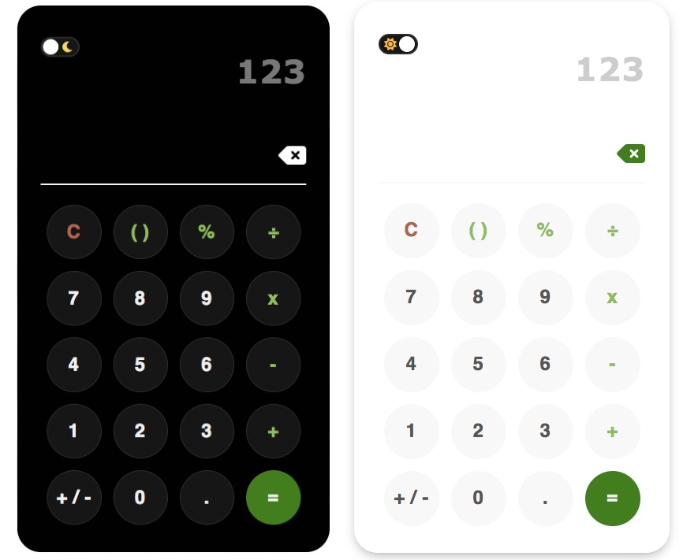

# Calculator

## Aim

Functional calculator created using HTML, SCSS and JavaScript. The visual design is based on a recreated image found on the internet. It is capable of performing the following operations: addition, subtraction, division and multiplication. Additionally, it also has the ability to work with decimals.

## Goal

Recreation of chosen calculator design by utilising EventListeners and knowledge of DOM Interactions.

## Live Site

Deployed site: https://amx3.github.io/Calculator/

## Inspiration

The interface of a Samsung calculator has been recreated. A toggle button that allows the user to switch from light to dark mode is a new addition alongside error messages.

|           Light Mode            |           Dark Mode            |
| :-----------------------------: | :----------------------------: |
|  |  |

### MVP:

Calculator:

-   HTML/SCSS

1. Create a calculator to be rendered to the html page
1. It should have number keys [0 to 9] and operator keys (+, -, /, \*, =)
1. It should also have a "." key
1. You should choose a picture of a calculator from the Internet and reproduce it in HTML/SCSS

-   JavaScript

1. Should render the current calculation in a box at the top (calculator display)
1. It should handle decimals
1. It doesn't need to support orders of operation
1. It should not use eval() or Function() constructor (edited)

## Calculator Implementation

1.  Several buttons were created and were categorised under two types: number buttons and specific operators buttons. Each button was assigned a value in HTML.

2.  Using the DOM to select HTML elements and assign them to a variable. The dark/light mode has been implemented.

3.  Iterate through each type of button group that appears on the calculator display.

4.  **Number keys**: Concatenation of numbers. There are a total of ten digits that can be displayed.

5.  **Operator keys**: Obtaining the integers preceding and after the chosen operator key. A switch statement is used to perform calculations. An eventListener is attached to the = key.

    -   Operator key (.): Handling decimals and the reoccurence of decimal points

6.  AC key: Resetting calculator display to empty

## Future Improvements

-   Handling order of operations (BODMAS) and additional operator keys

<!-- #### Additional Resources Used

-   Inspiration for toggle button appearance: https://www.youtube.com/watch?v=xodD0nw2veQ -->
