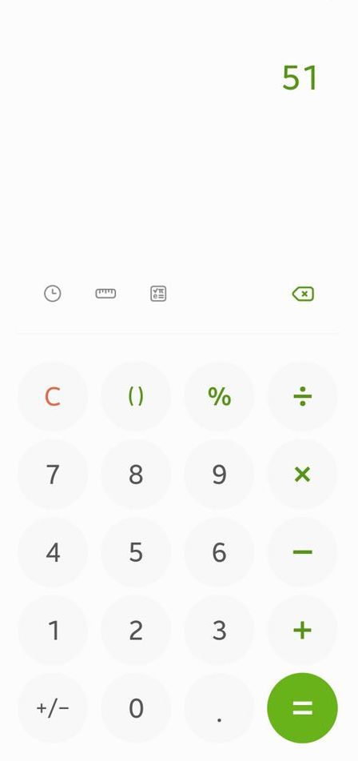
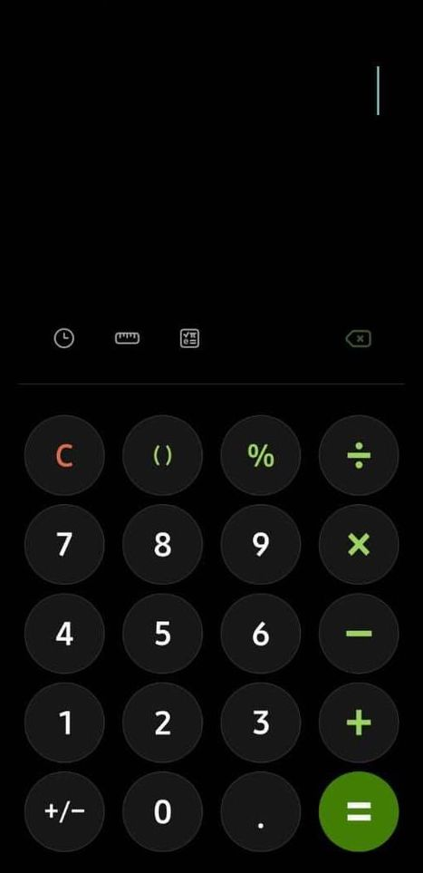

# Calculator

## Aim

Functional calculator created using HTML, SCSS and JavaScript. The visual design is based on a recreated image found on the internet. It is capable of performing the following operations: addition, subtraction, division and multiplication. Additionally, it also has the ability to work with decimals.

## Live Site

https://amx3.github.io/Calculator/

## Inspiration

The interface of a Samsung calculator has been recreated. A toggle button that allows the user to switch from light to dark mode is a new addition.

|           Light Mode            |           Dark Mode            |
| :-----------------------------: | :----------------------------: |
|  |  |

## Breakdown Logic -Initial

-   Classes in HTML file are going to be solely used for SCSS, in terms of appearance whilst ids are gonna be used when dealing with dom interactions and javascript.

-   Attached to each operator button (+, -, /, \*), there will be a function that will allow it to carry out the following operations.

-   The calculator display will act as the parent child for the text contained within it and should update once the = button is pushed.

-   Add an eventListener to the = button or just the calculator as a whole??

-   Havent really much thought about the specific operators such as the C, the decimal point etc. Do I have to consider BODMAS?

### MVP:

Calculator:

-   HTML/SCSS

1. Create a calculator to be rendered to the html page
1. it should have number keys from 0 to 9
1. It should have operator keys (+, -, /, \*, =)
1. It should have a display rendering the current calculation in a box at the top
1. It should also have a "." key
1. You should choose a picture of a calculator from the Internet and reproduce it in HTML/SCSS

-   JavaScript

1. Should render the current calculation in a box at the top (calculator display)
1. It should handle decimals
1. It doesn't need to support orders of operation
1. It should not use eval() or Function() constructor (edited)
